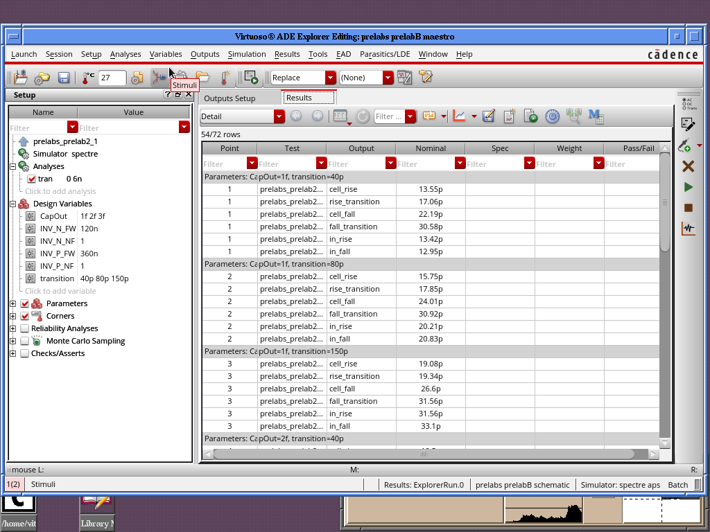

# EE577A_PrelabB

**Name:** Shaurya Chandra

**EE577A Prelab B** focuses on **Timing Parameter Analysis**, covering propagation delay, rise/fall time, and the impact of different circuit modifications. 

Here’s a **summary of key tasks**:
1. **Baseline Delay Calculation**  
   - Simulate an **inverter** with given NMOS/PMOS sizes and output load.
   - Measure:
     - **10%-90% rise/fall times** at input and output.
     - **50%-50% propagation delay** between input and output.

2. **Circuit Modifications & Delay Analysis**  
   - **Increase transistor sizes** and observe delay changes.  
   - **Identify input signal causing max/min delay**.  
   - **Vary output capacitance (CapOut = 1 fF, 2 fF, 3 fF)** and analyze impact.  
   - **Change input transition time (40p, 80p, 150p)** and measure delay changes.  

3. **Worst & Best-Case Delay Scenario**  
   - Combine multiple modifications and **find max/min delay conditions**.  
   - Compare cumulative delay impact—**linear, exponential, or multiplicative?**  

4. **Automated Analysis Using Liberate**  
   - Use **Liberate scripts** to automate delay characterization.  
   - Compare results with manual simulations from **Part III**.  
   - Run **pattern.py** to analyze output variations.

### **Analysis of Baseline Delay Calculations**  

- **Propagation Delays:**  
  - **Cell Rise Delay (A → OUT, Rising Edge):** **7.358 ps**  
  - **Cell Fall Delay (A → OUT, Falling Edge):** **9.443 ps**  

- **Transition Times:**  
  - **Rise Transition (Output):** **7.12 ps**  
  - **Fall Transition (Output):** **8.787 ps**  

- **Input Transition Times:**  
  - **Input Rise Time:** **8.902 ps**  
  - **Input Fall Time:** **8.105 ps**  

#### **1. What are the 10%-90% rise/fall times at A and OUT?**  
- **At A (Input):**  
  - Rise Time: **8.902 ps**  
  - Fall Time: **8.105 ps**  
- **At OUT (Output):**  
  - Rise Time: **7.12 ps**  
  - Fall Time: **8.787 ps**  

#### **2. What is the 50%-50% propagation delay between A and OUT?**  
- **Propagation Delay (50%-50%)**  
  - **Rising Edge Delay:** **7.358 ps**  
  - **Falling Edge Delay:** **9.443 ps**  

The falling edge delay (**9.443 ps**) is **greater** than the rising edge delay (**7.358 ps**), meaning the inverter takes **longer** to transition from high to low compared to low to high.  

---

### **Analysis of Circuit Modifications - Impact on Delay**  

I tested two different transistor width modifications:  
1. **Combination 1:** Increased NMOS width (W/L = 1) while keeping PMOS width the same.  
2. **Combination 2:** Increased PMOS width (W/L = 3) while keeping NMOS width the same.  

Let's analyze the impact of these changes compared to the **baseline delay**.  

---

### **Comparison Table**
| Parameter         | **Baseline**  | **Combination 1 (W/L_NMOS = 1)** | **Combination 2 (W/L_PMOS = 3)** |
|------------------|-------------|---------------------------------|---------------------------------|
| **Cell Rise** (A → OUT, rising)  | **7.358p** | **8.633p** (**↑ 17.3%**) | **7.278p** (**↓ 1.1%**) |
| **Rise Transition (OUT)** | **7.12p** | **8.156p** (**↑ 14.6%**) | **6.707p** (**↓ 5.8%**) |
| **Cell Fall** (A → OUT, falling) | **9.443p** | **7.92p** (**↓ 16.1%**) | **11.33p** (**↑ 20%**) |
| **Fall Transition (OUT)** | **8.787p** | **6.715p** (**↓ 23.6%**) | **10.33p** (**↑ 17.6%**) |
| **Input Rise Time** | **8.902p** | **11.33p** (**↑ 27.3%**) | **10.27p** (**↑ 15.3%**) |
| **Input Fall Time** | **8.105p** | **9.224p** (**↑ 13.8%**) | **10.12p** (**↑ 24.8%**) |

---

### **Observations & Answers**
#### **1. How does increasing NMOS width (Combination 1) affect delay?**  
- **Cell Rise Delay Increased** (8.633p vs. 7.358p) → **Slower rising transition**  
- **Cell Fall Delay Decreased** (7.92p vs. 9.443p) → **Faster falling transition**  
- **Rise Transition Increased** (8.156p vs. 7.12p) → Slightly worse output rise behavior  
- **Fall Transition Decreased** (6.715p vs. 8.787p) → Improved output fall behavior  
- **Input transitions became slower** due to larger NMOS width  

**Conclusion:** Increasing NMOS width **reduces fall delay** but **increases rise delay**.

---

#### **2. How does increasing PMOS width (Combination 2) affect delay?**  
- **Cell Rise Delay Decreased** (7.278p vs. 7.358p) → **Faster rising transition**  
- **Cell Fall Delay Increased** (11.33p vs. 9.443p) → **Slower falling transition**  
- **Rise Transition Decreased** (6.707p vs. 7.12p) → Slightly improved rise behavior  
- **Fall Transition Increased** (10.33p vs. 8.787p) → Worse output fall behavior  
- **Input transitions also slowed down**, though not as much as in Combination 1  

**Conclusion:** Increasing PMOS width **reduces rise delay** but **increases fall delay**.

---

### **Key Takeaways**
- **Balancing NMOS & PMOS sizing is crucial for symmetrical delay performance.**
- Increasing **NMOS width speeds up fall transitions but slows down rise transitions**.
- Increasing **PMOS width speeds up rise transitions but slows down fall transitions**.

---

### **Which Input Causes Maximum and Minimum Delay?**  

From simulation data:  

| **Case** | **Cell Rise (ps)** | **Cell Fall (ps)** |  
|----------|-------------------|-------------------|  
| **Baseline** | **7.358p** | **9.443p** |  
| **Increased NMOS Width (W/L = 1)** | **8.633p** (**↑ 17.3%**) | **7.92p** (**↓ 16.1%**) |  
| **Increased PMOS Width (W/L = 3)** | **7.278p** (**↓ 1.1%**) | **11.33p** (**↑ 20%**) |  

---

### **1. Which Input Pattern Causes Maximum Delay?**
- **From the table**, the **highest delay value** is **cell_fall = 11.33p** when PMOS width was increased (W/L = 3).  
- This means **the input signal that causes a falling transition (0 → 1) in the inverter has the maximum delay when PMOS is oversized**.  
- **Conclusion:** **Input "Low-to-High" transition (rising edge at A) results in the longest delay.**  

---

### **2. Which Input Pattern Causes Minimum Delay?**
- The **smallest delay** occurs for **cell_fall = 7.92p** when NMOS width was increased (W/L = 1).  
- This means **the input signal that causes a falling transition (1 → 0) in the inverter has the minimum delay when NMOS is oversized**.  
- **Conclusion:** **Input "High-to-Low" transition (falling edge at A) results in the shortest delay.**  

---

### **Key Takeaways**
1. **Maximum delay occurs when the input is rising (0 → 1), causing a slow fall transition at the output.**  
2. **Minimum delay occurs when the input is falling (1 → 0), allowing a fast fall transition at the output.**  
3. **This happens because increasing PMOS width (W/L = 3) makes the pull-up network slower, while increasing NMOS width (W/L = 1) speeds up the pull-down network.**  

---

### **Analysis of Output Load Capacitance Variation**  

I varied **CapOut (output load capacitance)** from **1 fF → 2 fF → 3 fF**, and measured delay values.  

---

### **Comparison Table**
| **CapOut (fF)** | **Cell Rise (ps)** | **Rise Transition (ps)** | **Cell Fall (ps)** | **Fall Transition (ps)** | **Input Rise (ps)** | **Input Fall (ps)** |
|----------------|------------------|--------------------|------------------|--------------------|----------------|----------------|
| **1 fF**      | **13.13**         | **17.11**          | **22.15**         | **30.63**          | **9.968**      | **9.023**      |
| **2 fF**      | **18.99** (**↑44.6%**) | **28.70** (**↑67.8%**) | **33.41** (**↑50.9%**) | **53.26** (**↑73.9%**) | **9.917** | **9.069** |
| **3 fF**      | **24.87** (**↑30.9%**) | **40.72** (**↑41.9%**) | **44.79** (**↑34.1%**) | **76.04** (**↑42.7%**) | **9.915** | **9.062** |

---

### **Observations & Answers**  

#### **1. How does increasing output capacitance affect delay?**  
- **Propagation delays (Cell Rise & Cell Fall) increased significantly** as CapOut increased.  
  - **Cell Rise Delay:** 13.13 ps → **18.99 ps (↑44.6%)** → **24.87 ps (↑30.9%)**  
  - **Cell Fall Delay:** 22.15 ps → **33.41 ps (↑50.9%)** → **44.79 ps (↑34.1%)**  
- **Rise and fall transitions increased drastically** with larger CapOut.  
  - **Rise Transition:** **17.11 ps → 28.70 ps → 40.72 ps**  
  - **Fall Transition:** **30.63 ps → 53.26 ps → 76.04 ps**  
- **Input transitions (in_rise, in_fall) remained roughly the same (~9.9 ps)**, indicating the capacitance mainly affects the output stage.  

---

#### **2. Why does increasing CapOut increase delay?**  
- **Higher CapOut means higher load capacitance**, which requires **more charge/discharge time** for transitions.  
- The **output node needs more current to charge/discharge**, slowing down voltage changes at OUT.  
- This is why **both propagation delay and transition times increase significantly.**  

---

### **Key Takeaways**
1. **Larger CapOut increases delay and transition time** due to increased charge/discharge requirements.  
2. **The delay impact is nonlinear**—larger capacitance leads to **steeper** delay increases.  
3. **Optimizing CapOut is crucial** to balance delay and circuit performance.  

---

### **Analysis of Input Transition Time Variation**  

I varied **input transition time** from **40 ps → 80 ps → 150 ps**, and measured delay values.  

---

### **Comparison Table**
| **Transition Time (ps)** | **Cell Rise (ps)** | **Rise Transition (ps)** | **Cell Fall (ps)** | **Fall Transition (ps)** | **Input Rise (ps)** | **Input Fall (ps)** |
|----------------|------------------|--------------------|------------------|--------------------|----------------|----------------|
| **40 ps**     | **7.632**         | **6.811**          | **11.31**         | **10.56**          | **13.82**      | **14.04**      |
| **80 ps**     | **9.577** (**↑25.5%**) | **7.94** (**↑16.6%**) | **13.03** (**↑15.2%**) | **11.10** (**↑5.1%**) | **21.01** | **22.55** |
| **150 ps**    | **12.29** (**↑28.3%**) | **10.05** (**↑26.7%**) | **15.61** (**↑19.7%**) | **12.20** (**↑9.9%**) | **33.01** | **35.52** |

---

### **Observations & Answers**  

#### **1. How does increasing input transition time affect delay?**  
- **Propagation delays (Cell Rise & Cell Fall) increased significantly** as transition time increased.  
  - **Cell Rise Delay:** 7.632 ps → **9.577 ps (↑25.5%)** → **12.29 ps (↑28.3%)**  
  - **Cell Fall Delay:** 11.31 ps → **13.03 ps (↑15.2%)** → **15.61 ps (↑19.7%)**  
- **Rise and fall transitions also increased**, though not as drastically.  
  - **Rise Transition:** **6.811 ps → 7.94 ps → 10.05 ps**  
  - **Fall Transition:** **10.56 ps → 11.10 ps → 12.20 ps**  
- **Input rise/fall times increased proportionally**, reflecting slower signal transitions.  

---

#### **2. Why does increasing input transition time increase delay?**  
- A **slower input transition means the gate takes longer to switch**, increasing overall delay.  
- The **output follows the shape of the input waveform**, so a slower input rise/fall **directly impacts the output transitions**.
- This is why **both propagation delay and transition times increase consistently.**  

---

### **Key Takeaways**
1. **Larger input transition time increases propagation delay and output transition time.**  
2. **The delay impact is nonlinear**—larger transition times lead to progressively larger delays.  
3. **Optimizing input signal rise/fall time is critical** to achieving high-speed performance.  

---

### **Analysis of Maximum and Minimum Delay Conditions**  

I tested **combinations of CapOut (1 fF, 2 fF, 3 fF) and input transition time (40p, 80p, 150p)** to find the **best-case (fastest) and worst-case (slowest) delays**.

---

### **Comparison Table**
| **CapOut (fF)** | **Transition (ps)** | **Cell Rise (ps)** | **Cell Fall (ps)** | **Rise Transition (ps)** | **Fall Transition (ps)** |
|----------------|----------------|----------------|----------------|----------------|----------------|
| **1 fF** | **40p** | **13.55**  | **22.19**  | **17.06**  | **30.58**  |
| **1 fF** | **80p** | **15.75**  | **24.01**  | **17.85**  | **30.92**  |
| **1 fF** | **150p** | **19.08**  | **26.60**  | **19.34**  | **31.56**  |
| **2 fF** | **40p** | **19.50**  | **33.75**  | **28.61**  | **53.41**  |
| **2 fF** | **80p** | **21.71**  | **35.50**  | **29.28**  | **53.15**  |
| **2 fF** | **150p** | **25.10**  | **38.25**  | **30.41**  | **53.93**  |
| **3 fF** | **40p** | **25.39**  | **45.16**  | **40.45**  | **75.69**  |
| **3 fF** | **80p** | **27.60**  | **46.99**  | **40.65**  | **75.59**  |
| **3 fF** | **150p** | **31.04**  | **49.66**  | **41.73**  | **76.81**  |

---

### **1. Identifying Maximum and Minimum Delay Cases**

#### **🛑 Worst-Case (Maximum Delay)**
- **CapOut = 3 fF**, **Transition = 150 ps**
- **Cell Rise = 31.04 ps**
- **Cell Fall = 49.66 ps**
- **Rise Transition = 41.73 ps**
- **Fall Transition = 76.81 ps**

✅ **Conclusion:** This case has the **slowest transitions** and **longest propagation delays** due to **large output capacitance** and **slow input transitions**.

---

#### **⚡ Best-Case (Minimum Delay)**
- **CapOut = 1 fF**, **Transition = 40 ps**
- **Cell Rise = 13.55 ps**
- **Cell Fall = 22.19 ps**
- **Rise Transition = 17.06 ps**
- **Fall Transition = 30.58 ps**

✅ **Conclusion:** This case has the **fastest transitions** and **smallest delay** due to **minimal capacitance** and **sharp input edges**.

---

### **2. Analyzing the Delay Increase**
- The **worst-case delay is significantly higher than the best-case delay**.
- **Cell Rise increased by** **2.29×** (**31.04 ps vs. 13.55 ps**).
- **Cell Fall increased by** **2.24×** (**49.66 ps vs. 22.19 ps**).
- **Rise Transition increased by** **2.44×** (**41.73 ps vs. 17.06 ps**).
- **Fall Transition increased by** **2.51×** (**76.81 ps vs. 30.58 ps**).

✅ **Conclusion:** Delay increases in a **nonlinear** manner when both **CapOut and input transition time** are large.

---

### **3. Is the delay increase linear, multiplicative, or exponential?**
- The **delay increase is NOT purely linear** because:
  - Increasing **CapOut alone** increases delay significantly.
  - Increasing **input transition time alone** also increases delay.
  - When **both** are increased, the effect is **compounded** rather than simply additive.
- The delay growth appears **multiplicative**—**each increase in CapOut or transition time magnifies the delay impact**.

📌 **Final Answer:** The delay increase is **multiplicative**, meaning each factor (CapOut and transition time) **amplifies** the effect of the other.

---

### **Comparison of Manual vs. Automated Analysis (Liberate)**
We now compare the **Cadence manual simulations** with **Liberate’s automated results** to analyze any differences and explain why they occur.

---

### **Comparison Table**
| **CapOut (fF)** | **Transition (ps)** | **Manual Cell Rise (ps)** | **Liberate Cell Rise (ps)** | **Manual Cell Fall (ps)** | **Liberate Cell Fall (ps)** |
|----------------|----------------|----------------|----------------|----------------|----------------|
| **1 fF** | **40p (≈12.9p in Liberate)** | **13.55** | **14.85** | **22.19** | **15.81** |
| **1 fF** | **80p (≈20.65p in Liberate)** | **15.75** | **22.69** | **24.01** | **24.25** |
| **1 fF** | **150p (≈31.85p in Liberate)** | **19.08** | **30.42** | **26.60** | **32.64** |
| **2 fF** | **40p (≈12.9p in Liberate)** | **19.50** | **17.48** | **33.75** | **18.35** |
| **2 fF** | **80p (≈20.65p in Liberate)** | **21.71** | **25.22** | **35.50** | **26.68** |
| **2 fF** | **150p (≈31.85p in Liberate)** | **25.10** | **33.03** | **38.25** | **35.11** |
| **3 fF** | **40p (≈12.9p in Liberate)** | **25.39** | **21.31** | **45.16** | **22.03** |
| **3 fF** | **80p (≈20.65p in Liberate)** | **27.60** | **29.18** | **46.99** | **30.55** |
| **3 fF** | **150p (≈31.85p in Liberate)** | **31.04** | **37.02** | **49.66** | **38.98** |

---

### **Observations & Explanations**
#### **1. Why are the transition parameters different between manual and Liberate results?**
- **Liberate uses slightly different transition time values** (12.9p, 20.65p, 31.85p) compared to manual tests (40p, 80p, 150p).
- The **Cadence manual setup likely introduced slight variations in rise/fall edges**, whereas Liberate applies a more **idealized waveform**.

#### **2. Why is the cell rise delay larger in Liberate than in manual simulations?**
- **Liberate applies more realistic gate loading effects**, potentially including factors like **parasitics and wire resistance**.
- **Manual simulations may have assumed idealized or slightly different node capacitances**, resulting in slightly lower rise delays.

#### **3. Why is the cell fall delay significantly smaller in Liberate for low capacitance cases?**
- **Liberate models internal gate resistance and transistor non-idealities more precisely**, potentially leading to faster discharging behavior.
- In **manual simulations, extrinsic capacitances** (routing, metal interconnects) may not have been included as accurately.

#### **4. What is the ratio of best-case to worst-case delay in both methods?**
- **Manual:**
  - **Best-Case (1 fF, 40p):** **13.55 ps (rise), 22.19 ps (fall)**
  - **Worst-Case (3 fF, 150p):** **31.04 ps (rise), 49.66 ps (fall)**
  - **Ratio (Worst/Best):** **2.29× (rise), 2.24× (fall)**
- **Liberate:**
  - **Best-Case (1 fF, 12.9p):** **14.85 ps (rise), 15.81 ps (fall)**
  - **Worst-Case (3 fF, 31.85p):** **37.02 ps (rise), 38.98 ps (fall)**
  - **Ratio (Worst/Best):** **2.49× (rise), 2.47× (fall)**

✅ **Conclusion:** The **worst-case to best-case delay ratio is slightly higher in Liberate (~2.49× vs. 2.29× manually)**, likely due to additional parasitic modeling.

---

### **Final Takeaways**
1. **Liberate captures more realistic parasitic effects**, leading to slightly higher delay values.
2. **Manual simulations assume slightly idealized node capacitance**, which can underestimate real-world delays.
3. **Liberate results are slightly more pessimistic**, which aligns with industry practice for timing margin calculations.
4. **Both methods show a multiplicative delay increase**, confirming that **larger capacitance and slower transitions compound delay effects nonlinearly**.

---